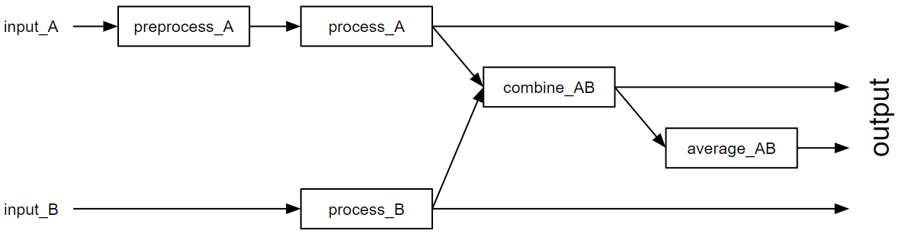

# EuXFEL Processing Update

Dean Keeble

---
## Processing Meeting 12th April 2023
Agenda: 
- uf-TS/PDF processing requirements
- EuXFEL processing capabilities
- Discussion of best processing route
- Downstream analysis

---
## Summary of Discussion
### Aim for automation as much as possible
- Use PDFGetX3 for processing
- One EuXEFL processing framework called EXtra-metro seems very suitable
- Some questions remain on best way to handle sample metadata

---
## EXtra-metro
- Operates on streams of data
- Allows for the description of processing graphs using a context, so a graph such as



---
```python
import numpy as np
import xarray as xr
from my_analysis_library import correct_background

# Do background correction for input A, add custom axes to A and B,
# calculate the interpolated quotient and average it.

@View.Compute
def preprocess_A(data: 'input_A'):
    # Correct background for input A.
    return correct_background(data)

@View.Vector
def process_A(data: 'preprocess_A'):
    # Add calibration axis specific for A.
    return xr.DataArray(data, dims=['position'],
                        coords={'position': np.linspace(0, 1, len(data)))

@View.Vector
def process_B(data: 'preprocess_B'):
    # Add calibration axis specific for B.
    return xr.DataArray(data, dims=['position'],
                        coords={'position': np.linspace(0, 1, len(data)))

@View.Vector
def combine_AB(data_A: 'process_A', data_B: 'process_B'):
    # Calculate interpolated quotient.
    common_axis = np.linspace(0, 1, min(len(data_A), len(data_B)))
    return data_A.interp(position=common_axis) / data_B.interp(position=common_axis)

@View.Vector_MovingAverage(N=20)
def average_AB(AB: 'combine_AB'):
    return AB
```
---

- These context files present an ideal language in which to discuss our processing needs in pure python
- Work is currently underway to describe our processing specifications (in some cases just using pseudo-code) in this format
- Aim to reuse code blocks for processing of accumulated data and reprocessing

---
## PDFGetX3 and detector gaps
The exact detector geometry is yet to be finalised, but processing should be prepared for incomplete data
  

---
<style>
img[alt~="center"] {
  display: block;
  margin: 0 auto;
}
</style>

